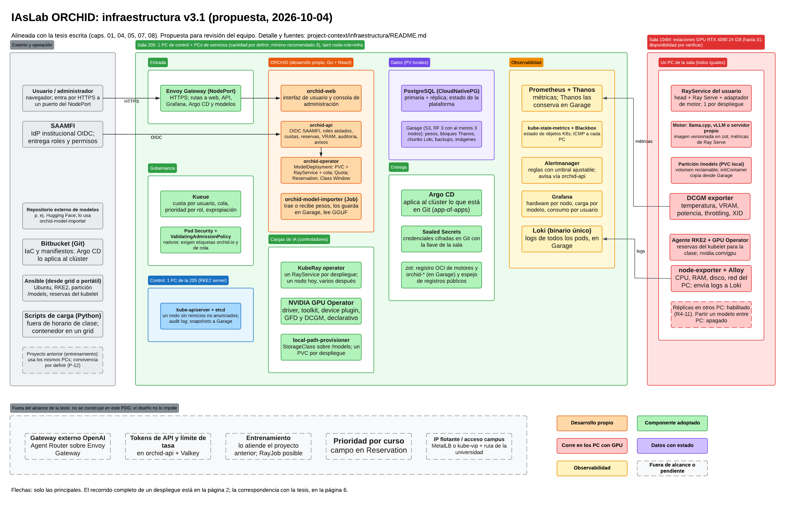
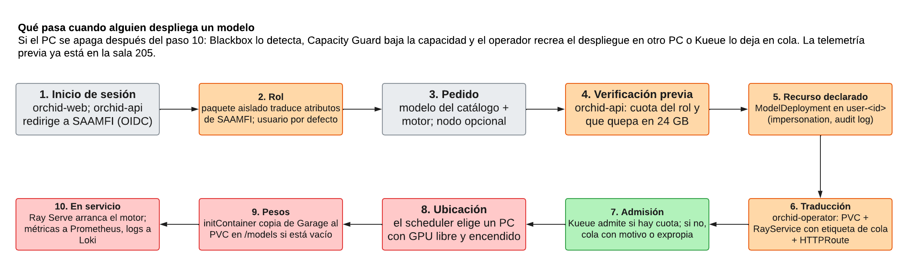
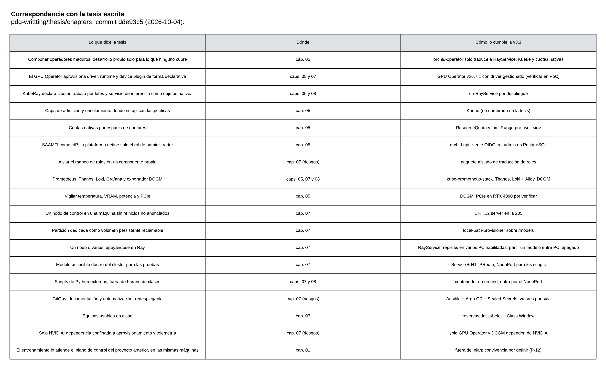
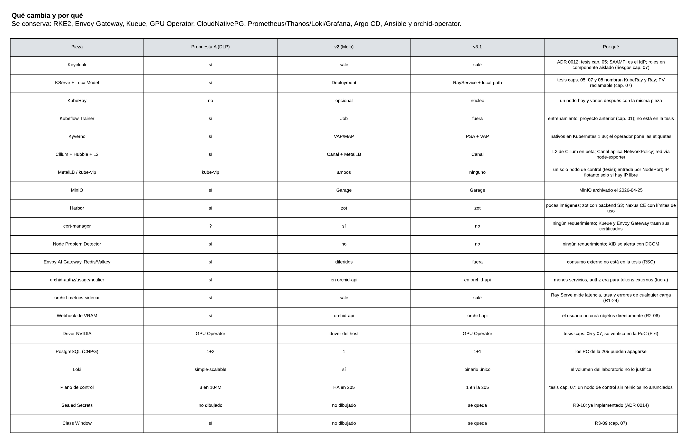
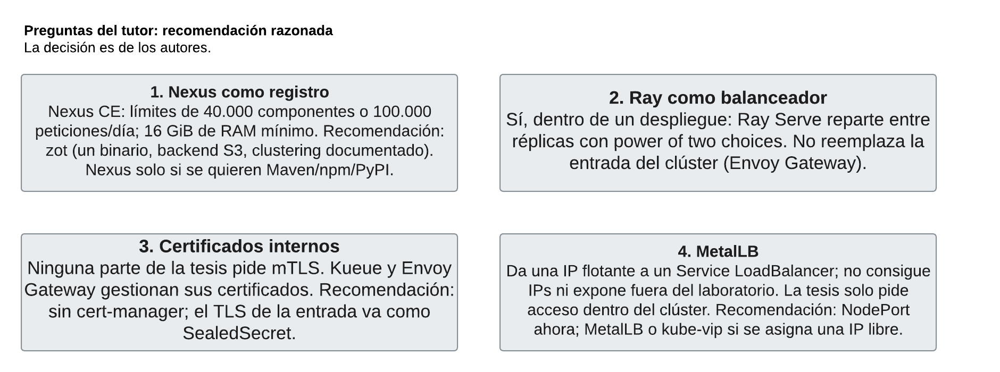
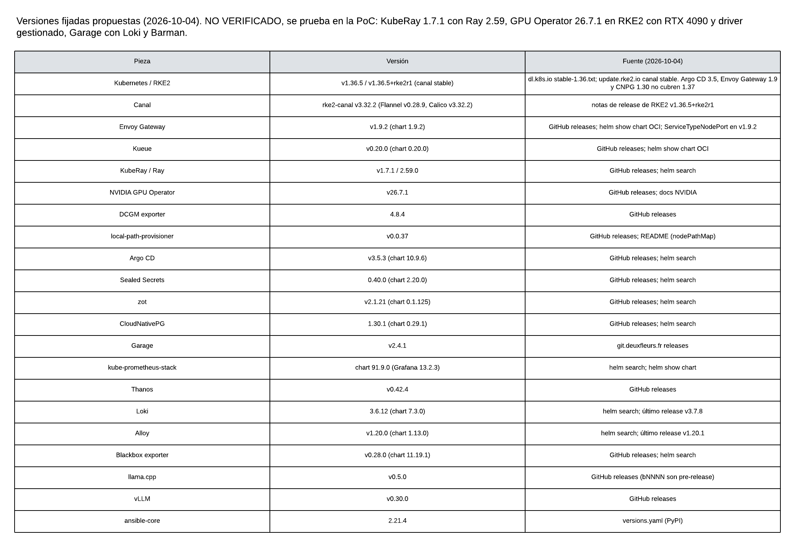

# Infraestructura de IAsLab ORCHID (v3.1)

- **Estado:** propuesta para revisión del equipo, 2026-10-04.
- **Fuente de verdad del alcance:** la tesis escrita (`thesis/chapters/`, commit `dde93c5`) y los requerimientos de la sección 2 de [`../requirements.md`](../requirements.md), que el capítulo 07 transcribe en la sección «Requerimientos por objetivo» (6.2 en el PDF). Los requerimientos sin compromiso (sección 3) no forman parte del plan (ver [§7](#7-fuera-del-alcance-de-la-tesis)).
- **Diagrama editable:** Lucidchart, «IAsLab ORCHID - Infraestructura v3.1 (propuesta)», https://lucid.app/lucidchart/fcdd4f5d-652f-416e-8970-c052b1a57bca/edit. Las imágenes de [`imagenes/`](imagenes/) son su exportación del 2026-10-04.
- **Historia:**
  - **v1:** propuesta de Juan José De La Pava, diagrama en Excalidraw. Es la que hoy describe `orchid/backend/docs/architecture/architecture.md`.
  - **v2:** corrección de Juan Camilo Melo en Lucidchart, tras los comentarios del tutor.
  - **v3.1:** esta versión. Revisa las dos anteriores contra la tesis, contra los requerimientos y contra la documentación oficial de cada pieza.

---

## Contenido

1. [Vista general](#1-vista-general)
2. [Topología física](#2-topología-física)
3. [Componentes](#3-componentes)
4. [Cómo se entra a la plataforma (sin MetalLB)](#4-cómo-se-entra-a-la-plataforma-sin-metallb)
5. [Flujo de un despliegue](#5-flujo-de-un-despliegue)
6. [Cobertura de la sección 6.2 de la tesis](#6-cobertura-de-la-sección-62-de-la-tesis)
7. [Fuera del alcance de la tesis](#7-fuera-del-alcance-de-la-tesis)
8. [Cambios frente a la v1 y la v2](#8-cambios-frente-a-la-v1-y-la-v2)
9. [Preguntas del tutor](#9-preguntas-del-tutor)
10. [Versiones y compatibilidad](#10-versiones-y-compatibilidad)
11. [Prueba de concepto en la sala](#11-prueba-de-concepto-en-la-sala)
12. [Pendiente de decisión](#12-pendiente-de-decisión)
13. [Fuentes](#13-fuentes)

---

## 1. Vista general

Las ideas que ordenan el diseño:

- **Ray sirve los modelos.** Cada despliegue de un usuario es un `RayService` de KubeRay que Kueue admite con la cuota de ese usuario. Hoy cada réplica corre en un solo PC. El mismo objeto admite repartir réplicas en varios PC (lo pide R4-11) y, cuando la red lo permita, partir un modelo entre PCs (R3-17). Así lo plantean los capítulos 05, 07 y 08 de la tesis, que nombran KubeRay y Ray.
- **Adoptar antes que construir** (capítulo 05). El código propio (`orchid-app/`) solo traduce lo que pide el usuario a objetos de las piezas adoptadas (Kueue, KubeRay y cuotas nativas de Kubernetes). No reimplementa admisión ni *serving*.
- **Separación física:**
  - La sala 205 aloja el control y los servicios.
  - Los PCs de la 104M solo ejecutan modelos y pueden apagarse sin afectar a nadie más que al modelo que tenían.
- **Pocas piezas.** Cada componente responde a un requerimiento. Lo que ningún requerimiento pide queda fuera.

## 2. Topología física

| Grupo | Máquinas | Qué corre |
| :--- | :--- | :--- |
| Control | 1 PC de la sala 205 | RKE2 *server* con etcd embebido. *Snapshots* de etcd a Garage. |
| Servicios | PCs de la sala 205, *taint* `node-role=infra`; **cantidad por definir** (mínimo recomendado: 3) | Entrada, componentes propios, gobernanza, datos, entrega y observabilidad |
| GPU | PCs de la sala 104M (RTX 4090, 24 GB), *taint* `nvidia.com/gpu`; **cantidad por definir** | Agente RKE2, componentes del GPU Operator, DCGM, node-exporter, Alloy y los `RayService` de los usuarios |
| Fuera del clúster | `grid100`/`grid101` o el portátil de quien opera | Ansible y los *scripts* de carga, en contenedores (regla de uso de los grid) |

- **Lo decidido es el rol de cada sala y que haya un solo nodo de control; no las cantidades.** Según `acceso-infraestructura-iaslab.md`, la 104M tiene hasta 31 PCs con GPU (`192.168.131.101` a `.131`) y la 205 hasta 22 sin GPU (`.61` a `.82`). Al 2026-10-04 solo un PC de cada sala respondió a `ping` desde los *grid*: cuántos estarán disponibles para el clúster está por verificar.
- **Inventario.** El número de PCs de cada grupo es un valor del inventario de Ansible por sala, no del diseño (R3-10).
- **Mínimos del diseño.** 3 nodos de servicios para Garage con factor de réplica 3 y para Argo CD en alta disponibilidad, y 2 para la réplica de PostgreSQL. Con menos, se baja el factor de réplica de Garage (nunca puede superar el número de nodos) y Argo CD va sin alta disponibilidad.
- **Nodo de control.** La tesis pide «un nodo de control» en «una máquina que permanece encendida sin reinicios no anunciados» (capítulo 07). Con un solo *server*, si ese PC se apaga, la API de Kubernetes deja de responder: no se pueden crear ni cambiar despliegues, pero los que ya corren siguen sirviendo. Hay que acordar con el laboratorio qué PC cumple esa condición (P-3).

## 3. Componentes

### 3.0 Externo

| Componente | Papel |
| :--- | :--- |
| Usuario / administrador | Usa `orchid-web` por HTTPS, a través del `NodePort` de Envoy Gateway |
| SAAMFI | Proveedor de identidad OAuth 2.0 / OIDC (§3.2) |
| Repositorio externo de modelos (p. ej. Hugging Face) | `orchid-model-importer` descarga de ahí los pesos cuando el usuario da un identificador (R3-29). Solo se usa al dar de alta un modelo; después los pesos se sirven desde Garage. |
| Bitbucket (Git) | Repositorio de IaC y manifiestos que aplica Argo CD |
| Ansible (desde un *grid* o un portátil) | Aprovisiona los nodos; corre fuera del clúster |
| *Scripts* de carga | Pruebas de rendimiento externas a la plataforma, fuera del horario de clases |
| Canal de notificaciones | Correo o chat donde `orchid-api` envía los avisos |
| Proyecto anterior (plano de control de entrenamiento) | Usa los mismos PCs (cap. 01); convivencia por definir (P-12) |

### 3.1 Aprovisionamiento y clúster

| Componente | Versión | Para qué | Por qué |
| :--- | :--- | :--- | :--- |
| Ansible (ansible-core) | 2.21.4 | Ubuntu, RKE2, partición `/models`, reservas del kubelet, llave de Sealed Secrets, instalación de Argo CD | Un inventario por sala permite redesplegar en otra sala. Pide Python ≥ 3.12 en el nodo de control de Ansible; en un grid (Ubuntu 22.04, Python 3.10) corre en un contenedor. |
| RKE2 | `v1.36.5+rke2r1` (Kubernetes v1.36.5, canal `stable`) | Distribución de Kubernetes | etcd embebido, instalación con Ansible. Se usa 1.36 y no 1.37 porque Argo CD 3.5, Envoy Gateway 1.9 y CloudNativePG 1.30 no cubren 1.37 ([§10](#10-versiones-y-compatibilidad)). |
| Canal (incluido en RKE2) | chart `rke2-canal` v3.32.2 (Flannel v0.28.9, Calico v3.32.2) | Red de *pods* y NetworkPolicy | CNI por defecto de RKE2. Según su documentación, «Canal uses Flannel for inter-node traffic and Calico for intra-node traffic and network policies». No pide kernel especial ni reemplazar kube-proxy. |

### 3.2 Entrada e identidad

| Componente | Versión | Para qué | Por qué |
| :--- | :--- | :--- | :--- |
| Envoy Gateway (Gateway API) | v1.9.2 | Entrada HTTPS: `orchid-web`, `orchid-api`, Grafana, Argo CD y una ruta por modelo. Publicada como `NodePort`. | Implementación de Gateway API. Trae sus propios certificados internos (`certgen`). Ver [§4](#4-cómo-se-entra-a-la-plataforma-sin-metallb). |
| Certificado HTTPS | no aplica | `Secret` TLS cifrado como `SealedSecret` | Sale de la universidad si hay nombre DNS institucional, o de una CA propia guardada en Ansible Vault (P-F). |
| SAAMFI | externo | Proveedor de identidad OAuth 2.0 / OIDC | Capítulo 05: comparable con Keycloak o Auth0; la plataforma define solo el rol de administrador. |
| Traducción de roles | propio (paquete aislado de `orchid-api`) | Atributos de SAAMFI → rol de la plataforma; `usuario` por defecto; `administrador` guardado en PostgreSQL | Mitigación escrita en los riesgos del capítulo 07: un cambio en SAAMFI solo toca este componente. No hay Keycloak. |
| Permisos sobre el clúster | nativo | Los usuarios no tienen credenciales de Kubernetes. `orchid-api` actúa con *impersonation* y RBAC por *namespace* `user-<id>`. *Audit log* del kube-apiserver. | Cumple R2-06 y R2-07 sin un segundo emisor de *tokens*. |

### 3.3 Gobernanza

| Componente | Versión | Para qué |
| :--- | :--- | :--- |
| Kueue | v0.20.0 | Cuota por usuario, cola con motivo, prioridad por rol, expropiación. Es la «capa de admisión y encolamiento» del capítulo 05 (la tesis no la nombra). Admite `RayService` desde v0.17.0 (con KubeRay ≥ 1.3.0). |
| Pod Security Admission | nativo | Perfil de seguridad de los *pods* en `user-*` |
| ValidatingAdmissionPolicy | nativo | Exige las etiquetas `orchid.io/user`, `orchid.io/deployment`, `orchid.io/workload-class` y la de cola. El operador las pone; la política impide que algo entre sin ellas. |

### 3.4 Cargas de IA

| Componente | Versión | Para qué |
| :--- | :--- | :--- |
| KubeRay operator | v1.7.1 | Un `RayService` por despliegue. Réplicas en varios PC: **habilitado**. Partir un modelo entre PCs: **apagado**. |
| Ray | 2.59.0 | *Runtime* de las imágenes de motores |
| NVIDIA GPU Operator | v26.7.1 | Driver, toolkit, *device plugin* (`nvidia.com/gpu`), GPU Feature Discovery (etiquetas de hardware) y DCGM, de forma declarativa (capítulos 05 y 07). En RKE2 se configura `toolkit.env CONTAINERD_SOCKET=/run/k3s/containerd/containerd.sock`. |
| local-path-provisioner | v0.0.37 | `StorageClass` sobre la partición `/models` (`nodePathMap`). Cada despliegue reclama un PVC; un `initContainer` copia los pesos desde Garage si el volumen está vacío. |

### 3.5 Motores

Cada motor es una imagen en zot que contiene Ray y un adaptador de Ray Serve. El adaptador arranca el motor, expone su API y publica métricas. Añadir un motor es añadir una imagen y una entrada al catálogo (R3-25).

| Motor | Versión | Notas |
| :--- | :--- | :--- |
| `llama.cpp` (CUDA sm_89, GGUF) | v0.5.0 | El adaptador lanza `llama-server --metrics`. Ese servidor publica *throughput*, peticiones en curso y diferidas, pero no TTFT ni latencia entre *tokens*: esas dos las mide el adaptador. Su *backend* RPC multinodo es, según su documentación, una prueba de concepto «fragile and insecure» y no se activa. |
| vLLM | v0.30.0 | Con Ray Serve LLM. Publica `vllm:time_to_first_token_seconds`, `vllm:inter_token_latency_seconds` y `vllm:num_requests_waiting`. Es el camino real para partir un modelo entre nodos: «supports cross-node tensor parallelism (TP) and pipeline parallelism (PP)». |
| Servidor propio (no-LLM) | imagen base Ray + PyTorch | El usuario entrega pesos y su servidor en Python. Ray Serve mide latencia, tasa y errores de cualquier carga (`ray_serve_deployment_processing_latency_ms`, `…_request_counter_total`, `…_error_counter_total`), así que no hace falta un *sidecar*. |

### 3.6 Componentes propios (`orchid-app/`, Go salvo la web)

| Componente | Para qué |
| :--- | :--- |
| `orchid-web` | Interfaz de usuario y consola de administración (React) |
| `orchid-api` | OIDC con SAAMFI; roles; CRUD de cuotas y reservas; verificación previa de cuota y de VRAM (metadatos GGUF); creación de `ModelDeployment`; auditoría; consumo por usuario desde Thanos; avisos (*webhook* de Alertmanager → correo o chat) |
| `orchid-operator` | ModelDeployment → `RayService` + PVC + `HTTPRoute`. Quota (plantilla por rol con sobrescritura) → *Namespace*, ResourceQuota, LimitRange, NetworkPolicy, ClusterQueue, LocalQueue, con sobreasignación del 10 al 20 %. Reservation. Capacity Guard (capacidad = GPU `Ready`). Class Window (*cordon* y *drain* en horario de clase). |
| `orchid-model-importer` | Job que trae pesos por ID de repositorio externo o por subida, los guarda en Garage y lee metadatos GGUF |

### 3.7 Datos

| Componente | Versión | Para qué |
| :--- | :--- | :--- |
| CloudNativePG | 1.30.1 | PostgreSQL de la plataforma y de Grafana: primaria + réplica, respaldo a Garage |
| Garage | v2.4.1 | Almacén S3 en los PCs de servicios, factor de réplica 3 si hay al menos 3: `models`, `thanos`, `loki`, `pg-backups`, `etcd-snapshots`, `session-logs`, `bench-results`, `registry`. Reemplaza a MinIO, cuyo repositorio quedó archivado el 2026-04-25. |

### 3.8 Entrega

| Componente | Versión | Para qué |
| :--- | :--- | :--- |
| Argo CD | v3.5.3 (chart 10.9.6) | GitOps: todo lo que corre en el clúster sale de Git |
| Sealed Secrets | 0.40.0 (chart 2.20.0) | Credenciales cifradas en Git con la llave de la sala |
| zot | v2.1.21 | Registro OCI de motores y `orchid-*` (almacena en Garage). También espejo de registros públicos (extensión *sync*, caché bajo demanda), para que operar no dependa de servicios externos (R3-11). |

### 3.9 Observabilidad

| Componente | Versión | Para qué |
| :--- | :--- | :--- |
| kube-prometheus-stack | chart 91.9.0 | Prometheus (con Thanos *sidecar*), Alertmanager, kube-state-metrics, node-exporter y Grafana 13.2.3 |
| Thanos | v0.42.4 | Retención larga y consulta única sobre Garage |
| Loki + Alloy | Loki 3.6.12 (chart 7.3.0), Alloy v1.20.0 | Logs de todos los *pods*, binario único. Alloy reemplaza a Promtail, que llegó a fin de vida el 2026-03-02. |
| DCGM exporter | 4.8.4 (dentro del GPU Operator) | Temperatura, VRAM, potencia, *throttling* y errores XID por GPU |
| Blackbox exporter | v0.28.0 | ICMP a cada PC: distingue «apagado» de «encendido que no responde» |
| Métricas de red | node-exporter | Bytes por interfaz durante las pruebas de carga (R4-06) |

## 4. Cómo se entra a la plataforma (sin MetalLB)

En un clúster propio, un `Service` de tipo `LoadBalancer` no recibe IP por sí solo.

**Qué hacen MetalLB y kube-vip.** Toman una IP de una lista, hacen que un nodo responda por ella en la red local y la pasan a otro nodo si el primero se apaga. **No consiguen IPs:** hay que pedirle al administrador de red direcciones libres de `192.168.131.0/24`. **Tampoco hacen visible la plataforma fuera del laboratorio:** eso depende de la redirección o del enrutamiento que configure la universidad.

**Qué pide la tesis:** que el modelo quede «accesible dentro del clúster» (capítulo 07). El acceso desde el campus es RSC-18 y no está en la tesis.

**Decisión de la v3.1:** Envoy Gateway como `NodePort` (verificado en el código de Envoy Gateway v1.9.2: `ServiceTypeNodePort`). Se entra por `https://<IP de un PC de servicios>:<puerto alto>`. No añade piezas y encaja con la costumbre de la universidad de usar puertos no habituales.

**Si más adelante se quiere una dirección fija o acceso desde el campus:** se pide una IP libre y se usa kube-vip con `kube-vip-cloud-provider`, o MetalLB v0.16.1. Solo cambia el tipo de `Service`.

## 5. Flujo de un despliegue

1. El usuario entra a `orchid-web`, que lo manda a SAAMFI.
2. Sus atributos se traducen al rol de la plataforma.
3. Elige modelo, motor y, si quiere, nodo.
4. `orchid-api` verifica la cuota y que el modelo quepa en 24 GB.
5. `orchid-api` crea el `ModelDeployment`.
6. El operador genera el PVC, el `RayService` con la etiqueta de cola y la ruta.
7. Kueue lo admite, lo deja en cola con el motivo o expropia una carga de menor prioridad.
8. El planificador elige un PC con GPU libre.
9. Los pesos se copian de Garage a `/models` si hace falta.
10. Ray Serve arranca el motor y la telemetría empieza a registrarse.

**Si el PC se apaga:** Blackbox lo detecta y Capacity Guard baja la capacidad. El operador recrea el despliegue en otro PC, o Kueue lo deja en cola. La telemetría previa ya está en la sala 205.

## 6. Cobertura de la sección 6.2 de la tesis

La v3.1 cubre los 113 requerimientos que lista la sección «Requerimientos por objetivo» (los de prioridad Alta y Media de la sección 2 de `requirements.md`). Ninguno queda sin cubrir.

| Grupo de la tesis | Componentes que lo cubren |
| :--- | :--- |
| Infraestructura base de telemetría (R1-01..08) | kube-prometheus-stack, Thanos, Loki + Alloy, Grafana, etiquetas exigidas por la ValidatingAdmissionPolicy |
| Telemetría de hardware (R1-09..18) | DCGM, node-exporter, Blackbox |
| Telemetría de la carga servida (R1-19..26) | métricas de `llama-server`/vLLM, adaptador (TTFT e ITL en `llama.cpp`), métricas de Ray Serve, *namespace* por usuario |
| Visualización y alertas (R1-27..30, R1-33) | Grafana, PrometheusRules, Alertmanager; Prometheus y Loki fuera de los PCs que se apagan |
| Identidad y control de acceso (R2-01..07) | `orchid-api` (OIDC, roles aislados), *impersonation* + RBAC, *audit log* |
| Cuotas y aislamiento (R2-08..16) | Kueue, ResourceQuota, LimitRange, NetworkPolicy (Canal), reservas del kubelet, Capacity Guard |
| Admisión, prioridad y reservas (R2-17, R2-19..29) | Kueue (cola, prioridad, expropiación), controlador Reservation, `orchid-api` |
| Módulo administrativo (R2-30..36) | `orchid-web` + `orchid-api` |
| Clúster base (R3-01..14) | RKE2, Canal, GPU Operator, *taints* y tolerancias, GFD, Ansible, Argo CD, Sealed Secrets, local-path-provisioner |
| Orquestación de cargas (R3-15..21) | `ModelDeployment` → `RayService`, Kueue, Loki, `Service` + `HTTPRoute` |
| Motores y modelos (R3-22..29) | zot, imágenes de `engines/`, catálogo, verificación de VRAM, importador |
| Interfaz de despliegue (R3-31..36) | `orchid-web` + `orchid-api` |
| Medición de desempeño (R4-01..08, R4-10, R4-11) | *scripts* de Python en un grid, API de Thanos, node-exporter, réplicas de Ray Serve en varios PC |

**Requerimientos que dependen de algo que solo se comprueba en la sala o de una decisión:**

| Requerimiento | Por qué |
| :--- | :--- |
| R1-10 temperatura de la memoria de la GPU (Alta) | En GPU de consumo, `DCGM_FI_DEV_MEMORY_TEMP` entrega 0 o nada (*issue* #460 de `NVIDIA/dcgm-exporter`). |
| R1-14 *throughput* PCIe y su panel (R1-27) | Las métricas de perfilado de PCIe no existen en la RTX 4090 (*issue* #506 de `NVIDIA/dcgm-exporter`). |
| R2-16 aislamiento ante el congelamiento | El laboratorio reporta que un modelo que desborda la VRAM hacia la RAM congela el PC. La mitigación (límite de memoria, verificación de VRAM, evicción) se mide en la sala. |
| R3-02 nodo de control sin reinicios no anunciados | Hace falta el acuerdo con el laboratorio sobre qué PC de la 205 (P-3). |
| R3-04 driver gestionado por el GPU Operator | NVIDIA valida el operador con GPU de centro de datos; la RTX 4090 no figura. Puede chocar con un driver ya instalado para las clases (P-6). |
| R3-11 sin nube pública | Las imágenes de terceros se bajan de registros públicos. Se mitiga con zot como espejo. |

## 7. Fuera del alcance de la tesis

Los requerimientos de la sección 3 de `requirements.md` no aparecen en los objetivos, en la sección 6.2, en las fases ni en el cronograma. El cronograma va hasta mayo de 2027 y está lleno. El capítulo 01 dice además que el entrenamiento lo atiende el plano de control del proyecto anterior.

La v3.1 **no los construye**, pero el diseño no los impide:

| Requerimiento sin compromiso | Si algún día se construye |
| :--- | :--- |
| *Gateway* externo compatible con OpenAI (RSC-10, 14, 16, 17) | Agent Router (antes Envoy AI Gateway) sobre el mismo Envoy Gateway |
| *Tokens* de API (RSC-11, 12, 15) | Paquete en `orchid-api` |
| Límite de tasa (RSC-13) | Límite de tasa global de Envoy Gateway + Valkey |
| Entrenamiento (RSC-01..09) | `RayJob` de KubeRay en la misma cuota de Kueue |
| Prioridad por curso (RSC-19..21) | Campo en Reservation |
| Acceso desde el campus (RSC-18) | IP flotante ([§4](#4-cómo-se-entra-a-la-plataforma-sin-metallb)) + enrutamiento de la universidad |

## 8. Cambios frente a la v1 y la v2

Lo que más pesa:

- **Sale KServe** y entra `RayService`, por lo que dice la tesis sobre KubeRay y Ray.
- **Salen** Kyverno (políticas nativas), Cilium y MetalLB (Canal y `NodePort`), MinIO (Garage), Harbor (zot), Keycloak (SAAMFI directo), cert-manager y Node Problem Detector (ningún requerimiento los pide).
- **Se integran en `orchid-api`:** `orchid-authz`, `orchid-usage` y `orchid-notifier`.
- **Plano de control:** un nodo, como dice la tesis.
- **Driver:** lo gestiona el GPU Operator, como dice la tesis.

## 9. Preguntas del tutor

| Pregunta | Qué dice la documentación oficial | Recomendación |
| :--- | :--- | :--- |
| Nexus como registro | Nexus Repository Community Edition tiene límites de 40.000 componentes o 100.000 peticiones al día, y un perfil mínimo de 4 vCPU y 16 GiB de RAM. zot tiene *backend* S3, *clustering* y espejo de registros. | zot. Nexus solo si se quieren también repositorios de Maven, npm o PyPI. |
| Ray como balanceador de carga | El *router* por defecto de Ray Serve reparte entre las réplicas de un despliegue con *power of two choices*. | Sí, dentro de un despliegue. No reemplaza la entrada del clúster. |
| Certificados internos | Ninguna parte de la tesis pide mTLS. Kueue trae `enableCertManager: false` por defecto y Envoy Gateway trae `certgen`. | Sin cert-manager. El certificado de la entrada va como `SealedSecret`. |
| MetalLB | Los anuncios L2 de Cilium están en beta. MetalLB L2 da una IP flotante, pero no consigue IPs ni expone fuera del laboratorio. | `NodePort` por ahora ([§4](#4-cómo-se-entra-a-la-plataforma-sin-metallb)). |

## 10. Versiones y compatibilidad

**Por qué Kubernetes 1.36 y no 1.37.** El 2026-10-04, RKE2 publica `v1.37.1+rke2r1` en el canal `latest` y `v1.36.5+rke2r1` en `stable`. Con 1.37, tres piezas quedan fuera de su rango:

| Pieza | Kubernetes soportado | Fuente |
| :--- | :--- | :--- |
| Argo CD 3.5 | 1.33–1.36 (probadas) | `docs/operator-manual/tested-kubernetes-versions.md` @v3.5.3 |
| Envoy Gateway 1.9 | 1.33–1.36 | matriz de compatibilidad de Envoy Gateway |
| CloudNativePG 1.30 | 1.34–1.36 (1.37 «Tested, but not supported») | `supported_releases.md` de CloudNativePG |
| NVIDIA GPU Operator 26.7 | 1.33–1.37 | *Platform support* de NVIDIA |
| Kueue 0.20 | «1.34 or newer» | README @v0.20.0 |

Con 1.36.5 todas las piezas que publican matriz quedan dentro de su rango. Cuando esas tres soporten 1.37, se sube.

**Sin verificar todavía (se prueba en la sala):**

- KubeRay 1.7.1 con Ray 2.59.0 (KubeRay no publica matriz).
- GPU Operator 26.7.1 sobre RKE2 (la documentación de RKE2 cubre hasta 26.3) y con la RTX 4090.
- Garage con Loki y con los respaldos de CloudNativePG (la documentación de Garage menciona Thanos, pero no Loki ni Barman).

**Estado de `orchid/backend/versions.yaml` al 2026-10-04:**

- Sus 10 entradas con versión coinciden con su fuente oficial.
- Para alinearlo con la v3.1:
  - **Cambiar** `kubernetes`/`rke2` a 1.36.5.
  - **Retirar** las piezas que salen.
  - **Llenar** las que hoy están en `null`.
  - **Agregar** `canal`, `local-path-provisioner`, `zot`, `garage` y `ray`.

## 11. Prueba de concepto en la sala

Antes de escribir los ADR definitivos, conviene comprobar en **1 PC de la 104M y 2 a 4 de la 205**:

1. **GPU Operator:** expone `nvidia.com/gpu` en la RTX 4090 con driver gestionado. Si el PC ya trae driver, se registra y se prueba `driver.enabled=false`.
2. **DCGM:** entrega temperatura del núcleo, VRAM, potencia y *throttling*. Se registra si hay temperatura de memoria y PCIe.
3. **`RayService`:** con el adaptador de `llama.cpp`, Kueue lo admite y lo expropia, usa un PVC en `/models` y responde por el `NodePort`. Sus métricas llegan a Prometheus.
4. **Garage:** Thanos y Loki escriben en él, y CloudNativePG hace un respaldo y una restauración.
5. **Apagado:** se apaga el PC de la 104M y el despliegue se recrea en otro.

## 12. Pendiente de decisión

| # | Pregunta | Corresponde a |
| :--- | :--- | :--- |
| P-1 | ¿Se corrige el encabezado de la sección 3 de `requirements.md` («se construyen») para que diga que no se programan en este PDG? ¿Se alinea la sección 3.1 (entrenamiento) con el capítulo 01? | autores |
| P-3 | ¿Cuántos PCs de cada sala están disponibles para el clúster? ¿Qué PC de la 205 es el nodo de control y el laboratorio se compromete a no reiniciarlo sin aviso? | autores + laboratorio |
| P-6 | Si los PCs necesitan el driver del host para las clases, ¿se ajusta el texto de la tesis sobre el GPU Operator (capítulos 05 y 07)? | autores (tras la prueba) |
| P-12 | ¿Cómo usa el proyecto anterior (plano de control de entrenamiento) los mismos PCs? Si usa la GPU fuera de este clúster, Kueue no lo ve. | autores + laboratorio |
| P-13 | ¿Se nombra Kueue en `technologies.md`? (El capítulo 05 lo deja pendiente.) | autores |
| P-F | ¿Hay un nombre DNS institucional para la plataforma? | laboratorio |
| R1-10, R1-14 | Si la prueba confirma que la RTX 4090 no da temperatura de memoria ni PCIe, ¿se ajustan esos requerimientos y la frase del capítulo 05? | autores (tras la prueba) |

## 13. Fuentes

Consultadas el 2026-10-04. Las versiones salen de los *releases* oficiales de GitHub, de `helm search repo` / `helm show chart` sobre los repositorios oficiales de cada chart, de PyPI y de `update.rke2.io`.

- RKE2:
  - notas de *release* `v1.36.5+rke2r1` y `v1.37.1+rke2r1`: https://github.com/rancher/rke2/releases
  - CNI: https://github.com/rancher/rke2-docs/blob/main/docs/networking/basic_network_options.md
  - GPU Operator: https://github.com/rancher/rke2-docs/blob/main/docs/add-ons/gpu_operators.md
- Argo CD, versiones de Kubernetes probadas: https://github.com/argoproj/argo-cd/blob/v3.5.3/docs/operator-manual/tested-kubernetes-versions.md
- Envoy Gateway:
  - matriz de compatibilidad: https://gateway.envoyproxy.io/news/releases/matrix/
  - `ServiceType`: https://github.com/envoyproxy/gateway/blob/v1.9.2/api/v1alpha1/shared_types.go
- CloudNativePG, versiones soportadas: https://cloudnative-pg.io/documentation/current/supported_releases/
- Kueue:
  - integraciones: https://kueue.sigs.k8s.io/docs/tasks/run/
  - `RayService`: https://kueue.sigs.k8s.io/docs/tasks/run/rayservices/
- Ray Serve:
  - monitorización: https://docs.ray.io/en/latest/serve/monitoring.html
  - *router* de peticiones: https://docs.ray.io/en/latest/serve/advanced-guides/custom-request-router.html
  - paralelismo entre nodos: https://docs.ray.io/en/latest/serve/llm/user-guides/cross-node-parallelism.html
- `llama.cpp`:
  - servidor y métricas: https://github.com/ggml-org/llama.cpp/blob/v0.5.0/tools/server/README.md
  - RPC: https://github.com/ggml-org/llama.cpp/blob/master/tools/rpc/README.md
- vLLM, métricas: https://docs.vllm.ai/en/latest/design/metrics.html
- NVIDIA:
  - GPU Operator: https://docs.nvidia.com/datacenter/cloud-native/gpu-operator/latest/getting-started.html
  - plataformas soportadas: https://docs.nvidia.com/datacenter/cloud-native/gpu-operator/latest/platform-support.html
  - dcgm-exporter, *issues* #460 y #506: https://github.com/NVIDIA/dcgm-exporter/issues
- Kubernetes, MutatingAdmissionPolicy: https://kubernetes.io/docs/reference/access-authn-authz/mutating-admission-policy/
- Cilium, anuncios L2: https://docs.cilium.io/en/stable/network/l2-announcements/
- MetalLB, capa 2: https://metallb.io/concepts/layer2/
- kube-vip, *cloud provider*: https://kube-vip.io/docs/usage/cloud-provider/
- Garage:
  - compatibilidad S3: https://garagehq.deuxfleurs.fr/documentation/reference-manual/s3-compatibility/
  - observabilidad: https://garagehq.deuxfleurs.fr/documentation/connect/observability/
- MinIO (archivado): https://github.com/minio/minio
- zot:
  - almacenamiento: https://zotregistry.dev/v2.1.21/articles/storage/
  - *mirroring*: https://zotregistry.dev/v2.1.21/articles/mirroring/
- Sonatype Nexus, requisitos: https://help.sonatype.com/en/sonatype-nexus-repository-system-requirements.html
- local-path-provisioner: https://github.com/rancher/local-path-provisioner
- Grafana Alloy, migración desde Promtail: https://grafana.com/docs/alloy/latest/set-up/migrate/from-promtail/
- Agent Router (antes Envoy AI Gateway): https://theagentrouter.ai/blog/envoy-ai-gateway-is-now-agent-router/
